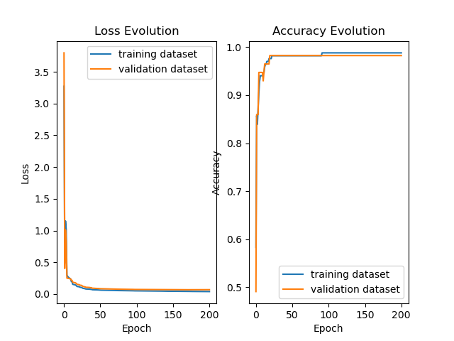

<a id="readme-top"></a>

[![Contributors][contributors-shield]][contributors-url]
[![Forks][forks-shield]][forks-url]
[![Stargazers][stars-shield]][stars-url]
[![Issues][issues-shield]][issues-url]
[![MIT License][license-shield]][license-url]
[![LinkedIn][linkedin-shield]][linkedin-url]

<!-- PROJECT LOGO -->
<br />
<div align="center">
  <a href="https://github.com/lennymalard/melpy-project">
    
  </a>

<h3 align="center" style="font-size: 25px;"> Crafting Deep Learning from the Ground Up </h3>
  <p align="center">
    <a>
    <br />
    <a href="https://github.com/lennymalard/melpy-project"><strong>Explore the docs »</strong></a>
    <br />
    <br />
    <a href="https://github.com/lennymalard/melpy-project">View Demo</a>
    ·
    <a href="https://github.com/lennymalard/melpy-project/issues/new?labels=bug&template=bug-report---.md">Report Bug</a>
    ·
    <a href="https://github.com/lennymalard/melpy-project/issues/new?labels=enhancement&template=feature-request---.md">Request Feature</a>
  </p>
</div>


<!-- TABLE OF CONTENTS -->
<details>
  <summary>Table of Contents</summary>
  <ol>
    <li>
      <a href="#about-the-project">About The Project</a>
      <ul>
        <li><a href="#built-with">Built With</a></li>
      </ul>
    </li>
    <li>
      <a href="#getting-started">Getting Started</a>
      <ul>
        <li><a href="#prerequisites">Prerequisites</a></li>
        <li><a href="#installation">Installation</a></li>
      </ul>
    </li>
    <li><a href="#usage">Usage</a></li>
    <li><a href="#roadmap">Roadmap</a></li>
    <li><a href="#contributing">Contributing</a></li>
    <li><a href="#license">License</a></li>
    <li><a href="#contact">Contact</a></li>
    <li><a href="#acknowledgments">Acknowledgments</a></li>
  </ol>
</details>


<!-- ABOUT THE PROJECT -->
## About The Project
The project was born in 2022, while I was still in high school. I was taking an online course in machine learning, but found myself frustrated at not understanding how all of these algorithms worked. So I decided to implement them myself in order to understand them perfectly.

First a python file, today melpy is a full-fledged library imitating today's best. You'll find tools for pre-processing data, as well as classes for training architectures such as FNN and CNN.

<p align="right">(<a href="#readme-top">back to top</a>)</p>


### Built With

 [![Numpy][Numpy.org]][numpy-url] [![Matplotlib][Matplotlib.org]][Matplotlib-url] [![tqdm][tqdm.github.io]][tqdm-url]
 
<p align="right">(<a href="#readme-top">back to top</a>)</p>


<!-- GETTING STARTED -->
## Getting Started

### Prerequisites

Melpy requires an up-to-date python environment. I recommend [conda](https://www.anaconda.com/download), which is dedicated to the scientific use of python.

All other prerequisites will be installed automatically during library installation.


### Installation

Melpy is available on PyPI as melpy. Run the following prompt in your environment terminal to install it:
   ```sh
   pip3 install melpy --upgrade
   ```


<p align="right">(<a href="#readme-top">back to top</a>)</p>


<!-- USAGE EXAMPLES -->
## Usage

To help you understand how to use Melpy, I'd like you to work with me on a mini-project so that you can get an overview of all the possible things you can do, as well as the possible errors you might encounter and their solutions.

Before we start creating a model, we need some data to train. Let's take a look at a classic case: the iris dataset. It consists of three classes labelled Setosa, Versiocolor and Virginica, which we'll classify using the following data: Sepal Length, Sepal Width, Petal Length and Petal Width.

```python
from sklearn.datasets import load_iris
from sklearn.model_selection import train_test_split

iris_dataset = load_iris()

X_train, X_test, y_train, y_test = train_test_split(
        iris_dataset['data'], iris_dataset['target'], test_size=0.25, random_state=0)
```
Let's take a look at these data.
```python
import matplotlib.pyplot as plt

plt.figure()
plt.scatter(X_train[:,0], X_train[:,1], c=y_train, alpha=0.3, cmap="coolwarm")
plt.show()
```
<br>
<div align="center">
 
 <p >
  <em>Figure 1</em>
 </p>
</div>

As we can see in Figure 1, there's a correlation between iris species, petal length and petal width. Do you see the decision boundaries ? We will try to reproduce them using our model, as you will see later.
<br>
<br>
We now need to pre-process the data. FNNs only accept data close to zero. This is why we're going to use a tool present in melpy.preprocessing: StandardScaler. 

The Standard Scaler is a pre-processing technique which consists of removing the mean from a data set and dividing by its variance. You can find out more about data scaling here: [Feature Scaling](https://en.wikipedia.org/wiki/Feature_scaling).

```python
from melpy.preprocessing import StandardScaler

sc = StandardScaler()
X_train = sc.transform(X_train) # Scales data
X_test = sc.transform(X_test) # Scaled with the same mean and variance than X_train
```

This is how we pre-processed the inputs. Concerning the outputs, we need to encode them with another pre-processing technique called One-hot encoding, accessible from melpy.preprocessing as OneHotEncoder. 

One-hot encoding is a method of representing categorical data as binary vectors. Each unique category is assigned a unique vector where one element is set to 1 (hot) and all others are 0.
You can find out more about data encoding here : [One-hot](https://en.wikipedia.org/wiki/One-hot).

```python
from melpy.preprocessing import OneHotEncoder

ohe = OneHotEncoder()
X_train = ohe.transform(X_train) # Encodes data
X_test = ohe.transform(X_test) # Encodes with the same encoding than y_train
```

Now that we've pre-processed our data, we can create our model. To do this, we first need to identify the problem in order to build a suitable model. 

We want to classify three classes identified by tabular data, which implies the use of [fully connected layers](https://en.wikipedia.org/wiki/Multilayer_perceptron), a [softmax](https://en.wikipedia.org/wiki/Softmax_function) [activation function](https://fr.wikipedia.org/wiki/Fonction_d%27activation) and a categorical [cost function](https://en.wikipedia.org/wiki/Loss_function). You may ask why ? The short answer is that fully connected layers ensure that all features are considered when learning the relationships within the data, the softmax activation function converts the output into probabilities that sum to 1 for multi-class classification, and the categorical cost function (which is [categorical cross-entropy](https://en.wikipedia.org/wiki/Cross-entropy) in our case) measures the difference between the predicted probabilities and the true class labels, providing an effective way to optimize the model during training. If you want a more in depth explaination on how Neural Networks work, I recommend you to watch the [3Blue1Brown](https://youtu.be/aircAruvnKk?si=QMDAzU8ThgQ_nmTt)'s series of videos, which gives a good insight into the subject.

Now that we know all this, we can build our model. To do this, we will use Sequential, available from melpy.NeuralNetworks. It's a class that lets you create and train architectures in the form of stacks of layers.

```python
import melpy.NeuralNetworks as nn

model = nn.Sequential(X_train, y_train, X_test, y_test)

model.add(nn.Dense(X_train.shape[1], 6), nn.ReLU())
model.add(nn.Dense(6, y_train.shape[1]), nn.Softmax())

model.compile(cost_function=nn.CategoricalCrossEntropy(), optimizer=nn.SGD(learning_rate=0.01))
```
Here we have indicated the training data and the validation data (The test set and validation set are usually separate, but here we simplify by using the test set as the validation set.). Next, we create the architecture, which here is a hidden layer composed of 6 neurons activated by the [ReLU](https://en.wikipedia.org/wiki/Rectifier_(neural_networks)) function. Finally, we define the cost function ([Categorical Cross-Entropy](https://en.wikipedia.org/wiki/Cross-entropy)) and the optimization method to be used (in this case, Batch [Gradient Descent](https://en.wikipedia.org/wiki/Gradient_descent), more commonly known as Stochastic [Gradient Descent](https://en.wikipedia.org/wiki/Gradient_descent)).

We then display the structure of our network with the summary method.

```python
model.summary()
```

```sh
Dense: (1, 6)
LeakyReLU: (1, 6)
Dense: (1, 3)
Softmax: (1, 3)
```

Note that we indicate the number of input features and the number of output classes.

At this point, all we need to do is train the model using the fit method and show the evolution of our metrics.
```python
model.fit(epochs=5000, verbose = 1)
model.results()
```
<div align="center">
 
 <p >
  <em>Figure 2</em>
 </p>
</div>

We performed forward propagation and backward propagation 5000 times to optimize our model. We can see from the verbose that we've achieved an accuracy of 98% for both datasets, which is already very good! We could in fact achieve a score of 100% using another architecture coupled with another optimization method such as Adam (Adaptive Momentum), but I will leave you the pleasure of experimenting on your own :) .

If you wish, you can now save your neural network parameters and metrics history to a file.

```python
model.save_params("iris_parameters")
model.save_histories("iris_metrics")
```

These two files are reusable. The first using the load_params(path) method and the second using the [pickle](https://docs.python.org/3/library/pickle.html) library.


_For more examples, please refer to the [Documentation](https://example.com)_

<p align="right">(<a href="#readme-top">back to top</a>)</p>


<!-- ROADMAP -->
## Roadmap

- [ ] Feature 1
- [ ] Feature 2
- [ ] Feature 3
    - [ ] Nested Feature

See the [open issues](https://github.com/github_username/repo_name/issues) for a full list of proposed features (and known issues).

<p align="right">(<a href="#readme-top">back to top</a>)</p>


<!-- CONTRIBUTING -->
## Contributing

Contributions are what make the open source community such an amazing place to learn, inspire, and create. Any contributions you make are **greatly appreciated**.

If you have a suggestion that would make this better, please fork the repo and create a pull request. You can also simply open an issue with the tag "enhancement".
Don't forget to give the project a star! Thanks again!

1. Fork the Project
2. Create your Feature Branch (`git checkout -b feature/AmazingFeature`)
3. Commit your Changes (`git commit -m 'Add some AmazingFeature'`)
4. Push to the Branch (`git push origin feature/AmazingFeature`)
5. Open a Pull Request

<p align="right">(<a href="#readme-top">back to top</a>)</p>

### Top contributors:

<a href="https://github.com/github_username/repo_name/graphs/contributors">
  
</a>


<!-- LICENSE -->
## License

Distributed under the MIT License. See `LICENSE.txt` for more information.

<p align="right">(<a href="#readme-top">back to top</a>)</p>


<!-- CONTACT -->
## Contact

Your Name - [@twitter_handle](https://twitter.com/twitter_handle) - email@email_client.com

Project Link: [https://github.com/github_username/repo_name](https://github.com/github_username/repo_name)

<p align="right">(<a href="#readme-top">back to top</a>)</p>


<!-- ACKNOWLEDGMENTS -->
## Acknowledgments

* []()
* []()
* []()

<p align="right">(<a href="#readme-top">back to top</a>)</p>


<!-- MARKDOWN LINKS & IMAGES -->
<!-- https://www.markdownguide.org/basic-syntax/#reference-style-links -->
[contributors-shield]: https://img.shields.io/github/contributors/lennymalard/melpy-project.svg?style=for-the-badge
[contributors-url]: https://github.com/lennymalard/melpy-project/graphs/contributors
[forks-shield]: https://img.shields.io/github/forks/lennymalard/melpy-project.svg?style=for-the-badge
[forks-url]: https://github.com/lennymalard/melpy-project/network/members
[stars-shield]: https://img.shields.io/github/stars/lennymalard/melpy-project.svg?style=for-the-badge
[stars-url]: https://github.comlennymalard/melpy-project/stargazers
[issues-shield]: https://img.shields.io/github/issues/lennymalard/melpy-project.svg?style=for-the-badge
[issues-url]: https://github.com/lennymalard/melpy-project/issues
[license-shield]: https://img.shields.io/github/license/lennymalard/melpy-project.svg?style=for-the-badge
[license-url]: https://github.com/lennymalard/melpy-project/blob/main/LICENSE
[linkedin-shield]: https://img.shields.io/badge/-LinkedIn-black.svg?style=for-the-badge&logo=linkedin&colorB=555
[linkedin-url]: https://www.linkedin.com/in/lennymalard
[product-screenshot]: images/screenshot.png
[Numpy-url]: https://numpy.org/
[Numpy.org]:https://img.shields.io/badge/numpy-red?style=for-the-badge&logo=numpy&labelColor=blue&color=blue
[Matplotlib-url]: https://matplotlib.org
[Matplotlib.org]: https://img.shields.io/badge/matplotlib-orange?style=for-the-badge&logo=matplotlib&labelColor=blue&color=blue&link=https%3A%2F%2Fmatplotlib.org%2F
[tqdm-url]: https://tqdm.github.io
[tqdm.github.io]: https://img.shields.io/badge/tqdm-orange?style=for-the-badge&logo=tqdm&labelColor=blue&color=blue&link=https%3A%2F%2Ftqdm.github.io%2F

