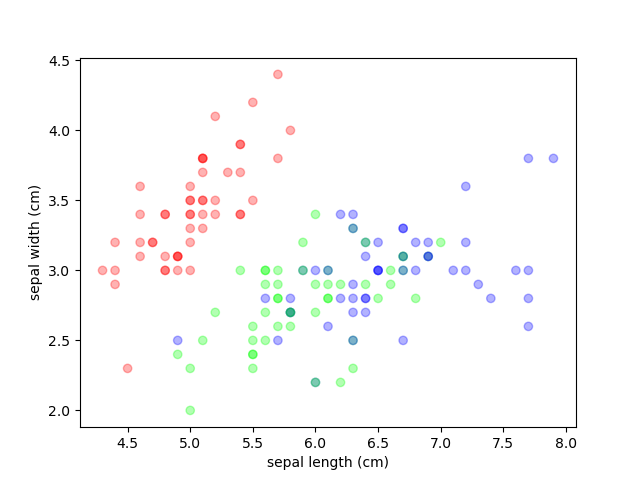
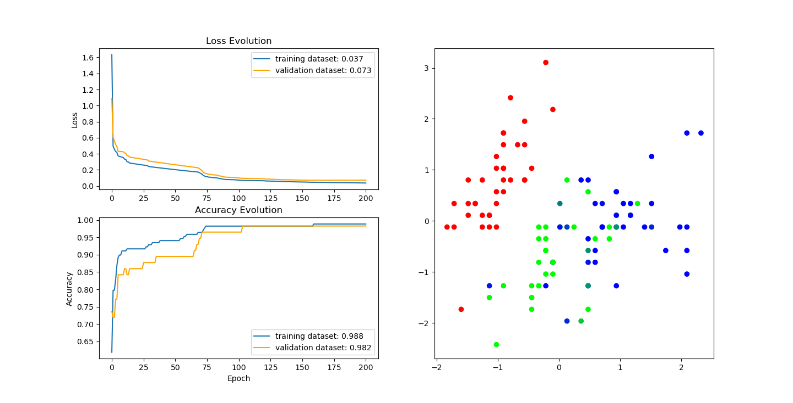

<a id="readme-top"></a>

[![Contributors][contributors-shield]][contributors-url]
[![Forks][forks-shield]][forks-url]
[![Stargazers][stars-shield]][stars-url]
[![Issues][issues-shield]][issues-url]
[![MIT License][license-shield]][license-url]
[![LinkedIn][linkedin-shield]][linkedin-url]

<!-- PROJECT LOGO -->
<br />
<div align="center">
  <a href="https://github.com/lennymalard/melpy-project">
    
  </a>

<h3 align="center" style="font-size: 25px;"> Crafting Deep Learning from the Ground Up </h3>
  <p align="center">
    <a>
    <br />
    <a href="https://github.com/lennymalard/melpy-project"><strong>Explore the docs »</strong></a>
    <br />
    <br />
    <a href="https://github.com/lennymalard/melpy-project">View Demo</a>
    ·
    <a href="https://github.com/lennymalard/melpy-project/issues/new?labels=bug&template=bug-report---.md">Report Bug</a>
    ·
    <a href="https://github.com/lennymalard/melpy-project/issues/new?labels=enhancement&template=feature-request---.md">Request Feature</a>
  </p>
</div>


<!-- TABLE OF CONTENTS -->
<details>
  <summary>Table of Contents</summary>
  <ol>
    <li>
      <a href="#about-the-project">About The Project</a>
      <ul>
        <li><a href="#built-with">Built With</a></li>
      </ul>
    </li>
    <li>
      <a href="#getting-started">Getting Started</a>
      <ul>
        <li><a href="#prerequisites">Prerequisites</a></li>
        <li><a href="#installation">Installation</a></li>
      </ul>
    </li>
    <li><a href="#usage">Usage</a></li>
    <li><a href="#roadmap">Roadmap</a></li>
    <li><a href="#contributing">Contributing</a></li>
    <li><a href="#license">License</a></li>
    <li><a href="#contact">Contact</a></li>
    <li><a href="#acknowledgments">Acknowledgments</a></li>
  </ol>
</details>


<!-- ABOUT THE PROJECT -->
## About The Project
The project started in 2022 when I was still in high school. While taking an online machine learning course, I got frustrated with not fully understanding how the algorithms worked. To solve this, I decided to implement them myself to gain a deeper and clearer understanding.

What started as a simple Python script has become Melpy, a deep learning library built entirely from scratch using NumPy. Melpy is inspired by the best tools available and makes it easy to create and train models like FNNs and CNNs. It also includes tools for data preprocessing and data visualization, making it a complete solution for deep learning.
 
<p align="right">(<a href="#readme-top">back to top</a>)</p>

### Built With

 [![Numpy][Numpy.org]][numpy-url] [![Matplotlib][Matplotlib.org]][Matplotlib-url] [![tqdm][tqdm.github.io]][tqdm-url]
 
<p align="right">(<a href="#readme-top">back to top</a>)</p>

<!-- GETTING STARTED -->
## Getting Started

### Prerequisites

Melpy requires an up-to-date python environment. I recommend [conda](https://www.anaconda.com/download), which is dedicated to the scientific use of python.

All other dependencies will be installed automatically during the library installation process.


### Installation

Melpy is available on PyPI as melpy. Run the following command to install it in your environment:
   ```sh
   pip3 install melpy --upgrade
   ```


<p align="right">(<a href="#readme-top">back to top</a>)</p>

<!-- USAGE EXAMPLES -->
## Usage

To demonstrate Melpy’s capabilities, let’s work through a mini-project together. We will classify the Iris dataset, a classic example in machine learning. The dataset contains three classes: Setosa, Versicolor, and Virginica, described by the following features: Sepal Length, Sepal Width, Petal Length, and Petal Width.

First, let’s load the data and split it into training and test sets:

```python
from sklearn.datasets import load_iris
from sklearn.model_selection import train_test_split

iris_dataset = load_iris()

X_train, X_test, y_train, y_test = train_test_split(
        iris_dataset['data'], iris_dataset['target'], test_size=0.25, random_state=0)
```
Next, visualize the data to identify any patterns:
```python
import matplotlib.pyplot as plt

plt.figure()
plt.scatter(X_train[:,0], X_train[:,1], c=y_train, alpha=0.3, cmap="coolwarm")
plt.show()
```
<br>
<div align="center">
 
 <p >
  <em>Figure 1</em>
 </p>
</div>

As we can see in Figure 1, there is a clear correlation between species and features like Sepal Length and Sepal Width.
<br>
<br>

### Preprocessing

FNNs require input data to be scaled close to zero. It is why we are now going to use StandardScaler from melpy.preprocessing :

<em>The Standard Scaler is a pre-processing technique which consists of removing the mean from a data set and dividing by its variance. You can find out more about data scaling here: [Feature Scaling](https://en.wikipedia.org/wiki/Feature_scaling).</em>

```python
from melpy.preprocessing import StandardScaler

sc = StandardScaler()
y_train = sc.transform(y_train) # Scales data
y_test = sc.transform(y_test) # Scaled with the same mean and variance than X_train
```

Next, we encode the target labels using OneHotEncoder, also from melpy.preprocessing:

<em>One-hot encoding is a method of representing categorical data as binary vectors. Each unique category is assigned a unique vector where one element is set to 1 (hot) and all others are 0.
You can find out more about data encoding here : [One-hot](https://en.wikipedia.org/wiki/One-hot).</em>

```python
from melpy.preprocessing import OneHotEncoder

ohe = OneHotEncoder()
X_train = ohe.transform(X_train) # Encodes data
X_test = ohe.transform(X_test) # Encodes with the same encoding than y_train
```

### Model Creation

We’re tackling a multi-class classification problem using tabular data, which requires:
*	[Fuly Connected Layers](https://en.wikipedia.org/wiki/Multilayer_perceptron) (Dense) for feature extraction.
*	[Softmax](https://en.wikipedia.org/wiki/Softmax_function) [Activation](https://fr.wikipedia.org/wiki/Fonction_d%27activation) to convert outputs into probabilities.
*	[Categorical Cross-Entropy](https://en.wikipedia.org/wiki/Cross-entropy) as the cost function for optimization.

Now, let’s build the model using Melpy’s Sequential class:

<em>Sequential models are neural networks where layers are stacked in a linear order. Data flows through them one by one in sequence.</em>

```python
import melpy.NeuralNetworks as nn

model = nn.Sequential(X_train, y_train, X_test, y_test)

model.add(nn.Dense(X_train.shape[1], 6), nn.ReLU())
model.add(nn.Dense(6, y_train.shape[1]), nn.Softmax())

model.compile(cost_function=nn.CategoricalCrossEntropy(), optimizer=nn.SGD(learning_rate=0.01))
```

We define:
* The training inputs and the training outputs
* The validation inputs and the validation outputs
* A hidden layer with 6 neurons and [ReLU](https://en.wikipedia.org/wiki/Rectifier_(neural_networks)) [activation](https://fr.wikipedia.org/wiki/Fonction_d%27activation).
* A [Softmax](https://en.wikipedia.org/wiki/Softmax_function) output layer for classification.
* [Categorical Cross-Entropy](https://en.wikipedia.org/wiki/Cross-entropy) for loss calculation.
* [Stochastic Gradient Descent (SGD)](https://en.wikipedia.org/wiki/Stochastic_gradient_descent) for optimization.

<em>These functions together form what we call an architecture. If you’re new to deep learning, I highly recommend [3Blue1Brown](https://youtu.be/aircAruvnKk?si=QMDAzU8ThgQ_nmTt)'s excellent video series on the topic. It provides a clear explanation of how and why these functions are used.</em>

### Model Summary

We can view the model structure with:

```python
model.summary()
```

```sh
Dense: (1, 6)
ReLU: (1, 6)
Dense: (1, 3)
Softmax: (1, 3)
```

### Training the Model

Finally, we train the model with 5000 epochs and observe the results with verbose and LiveMetrics :

```python
model.fit(epochs=5000, verbose = 1, callbacks=[nn.LiveMetrics()])
model.results()
```
<div align="center">
 
 <p >
  <em>Figure 2</em>
 </p>
</div>

```sh
Epoch [5000/5000]: 100%|██████████| 5000/5000 [00:03<00:00, 1543.94it/s, loss=0.0389, accuracy=0.988]

-------------------------------------------------------------------
| [TRAINING METRICS] train_loss: 0.03893 · train_accuracy: 0.9881 |
-------------------------------------------------------------------
| [VALIDATION METRICS] val_loss: 0.06848 · val_accuracy: 0.98246  |
-------------------------------------------------------------------
```

Our model achieves 98% accuracy on both training and test datasets, which is good! With further optimization you could potentially reach 100%. Feel free to experiment!

If you look closely, you will notice that the plot on the right closely resembles Figure 1. It’s actually the model’s inputs colored by the outputs, allowing us to visually assess whether the model is well trained.

### Save Your Work

Save your trained parameters and metrics for future use:

```python
model.save_params("iris_parameters")
model.save_histories("iris_metrics")
```

You can reload the parameters with load_params(path) and the metrics using the [pickle](https://docs.python.org/3/library/pickle.html) library.


_For more examples, please refer to the [Documentation](https://example.com)_

<p align="right">(<a href="#readme-top">back to top</a>)</p>


<!-- ROADMAP -->
## Roadmap

I plan to speed up computations using Numba or JAX and to implement additional deep learning architectures, as well as more traditional machine learning algorithms.


See the [open issues](https://github.com/lennymalard/melpy-project/issues) for a full list of proposed features (and known issues).

<p align="right">(<a href="#readme-top">back to top</a>)</p>


<!-- CONTRIBUTING -->
## Contributing

Contributions are what make the open source community such an amazing place to learn, inspire, and create. Any contributions you make are **greatly appreciated**.

If you have a suggestion that would make this better, please fork the repo and create a pull request. You can also simply open an issue with the tag "enhancement".
Don't forget to give the project a star! Thanks again!

1. Fork the Project
2. Create your Feature Branch (`git checkout -b feature/AmazingFeature`)
3. Commit your Changes (`git commit -m 'Add some AmazingFeature'`)
4. Push to the Branch (`git push origin feature/AmazingFeature`)
5. Open a Pull Request

<p align="right">(<a href="#readme-top">back to top</a>)</p>

<!-- LICENSE -->
## License

Distributed under the MIT License. See `LICENSE.txt` for more information.

<p align="right">(<a href="#readme-top">back to top</a>)</p>


<!-- CONTACT -->
## Contact

Lenny Malard - lennymalard@gmail.com or [linkedin](https://www.linkedin.com/in/lennymalard/)

Project Link: [https://github.com/lennymalard/melpy-project](https://github.com/lennymalard/melpy-project")

<p align="right">(<a href="#readme-top">back to top</a>)</p>


<!-- MARKDOWN LINKS & IMAGES -->
<!-- https://www.markdownguide.org/basic-syntax/#reference-style-links -->
[contributors-shield]: https://img.shields.io/github/contributors/lennymalard/melpy-project.svg?style=for-the-badge
[contributors-url]: https://github.com/lennymalard/melpy-project/graphs/contributors
[forks-shield]: https://img.shields.io/github/forks/lennymalard/melpy-project.svg?style=for-the-badge
[forks-url]: https://github.com/lennymalard/melpy-project/network/members
[stars-shield]: https://img.shields.io/github/stars/lennymalard/melpy-project.svg?style=for-the-badge
[stars-url]: https://github.com/lennymalard/melpy-project/stargazers
[issues-shield]: https://img.shields.io/github/issues/lennymalard/melpy-project.svg?style=for-the-badge
[issues-url]: https://github.com/lennymalard/melpy-project/issues/
[license-shield]: https://img.shields.io/github/license/lennymalard/melpy-project.svg?style=for-the-badge
[license-url]: https://github.com/lennymalard/melpy-project/blob/main/LICENSE
[linkedin-shield]: https://img.shields.io/badge/-LinkedIn-black.svg?style=for-the-badge&logo=linkedin&colorB=555
[linkedin-url]: https://www.linkedin.com/in/lennymalard
[product-screenshot]: images/screenshot.png
[Numpy-url]: https://numpy.org/
[Numpy.org]:https://img.shields.io/badge/numpy-red?style=for-the-badge&logo=numpy&labelColor=blue&color=blue
[Matplotlib-url]: https://matplotlib.org
[Matplotlib.org]: https://img.shields.io/badge/matplotlib-orange?style=for-the-badge&logo=matplotlib&labelColor=blue&color=blue&link=https%3A%2F%2Fmatplotlib.org%2F
[tqdm-url]: https://tqdm.github.io
[tqdm.github.io]: https://img.shields.io/badge/tqdm-orange?style=for-the-badge&logo=tqdm&labelColor=blue&color=blue&link=https%3A%2F%2Ftqdm.github.io%2F


