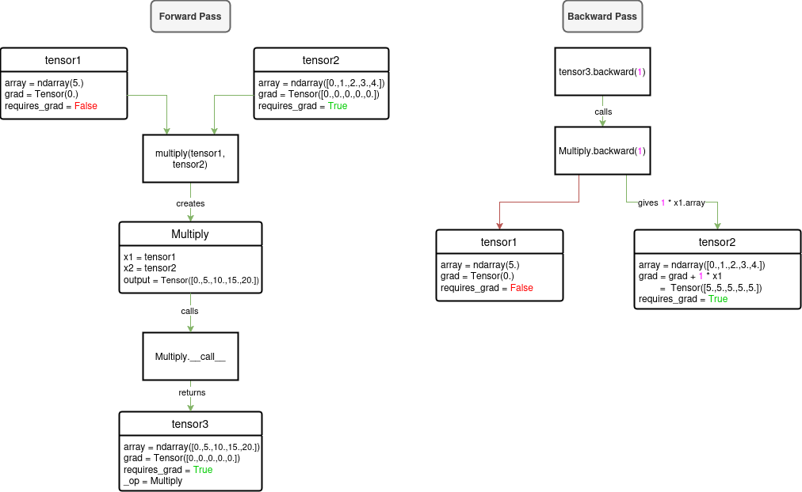

<a id="readme-top"></a>

[![Contributors][contributors-shield]][contributors-url]
[![Forks][forks-shield]][forks-url]
[![Stargazers][stars-shield]][stars-url]
[![Issues][issues-shield]][issues-url]
[![MIT License][license-shield]][license-url]
[![LinkedIn][linkedin-shield]][linkedin-url]

<!-- PROJECT LOGO -->
<br />
<div align="center">
  <a href="https://github.com/lennymalard/melpy-project">
    
  </a>

<h3 align="center" style="font-size: 25px;"> Crafting Deep Learning from the Ground Up </h3>
  <p align="center">
    <a>
    <br />
    <a href="https://github.com/lennymalard/melpy-project"><strong>Explore the docs »</strong></a>
    <br />
    <br />
    <a href="https://github.com/lennymalard/melpy-project">View Demo</a>
    ·
    <a href="https://github.com/lennymalard/melpy-project/issues/new?labels=bug&template=bug-report---.md">Report Bug</a>
    ·
    <a href="https://github.com/lennymalard/melpy-project/issues/new?labels=enhancement&template=feature-request---.md">Request Feature</a>
  </p>
</div>


<!-- TABLE OF CONTENTS -->
<details>
  <summary>Table of Contents</summary>
  <ol>
    <li>
      <a href="#about-the-project">About The Project</a>
      <ul>
        <li><a href="#built-with">Built With</a></li>
      </ul>
    </li>
    <li>
      <a href="#getting-started">Getting Started</a>
      <ul>
        <li><a href="#prerequisites">Prerequisites</a></li>
        <li><a href="#installation">Installation</a></li>
      </ul>
    </li>
    <li><a href="#core-features">Core Features</a></li>
      <ul>
        <li><a href="#automatic-differentiation-engine">Automatic Differentiation Engine</a></li>
        <li><a href="#popular-deep-learning-architectures">Popular Deep Learning Architectures</a></li>
        <li><a href="#modularity-and-extensibility">Modularity and Extensibility</a></li>
      </ul>
    <li><a href="#model-creation-and-training">Model Creation and Training</a></li>
      <ul>
        <li><a href="#preprocessing">Preprocessing</a></li>
        <li><a href="#model-creation">Model Creation</a></li>
        <li><a href="#model-summary">Model Summary</a></li>
        <li><a href="#training-the-model">Training the Model</a></li>
        <li><a href="#save-your-work">Save your Work</a></li>
      </ul>
    <li><a href="#errors">Errors</a></li>
       <ul>
        <li><a href="#shape-errors">Shape Errors</a></li>
      </ul>
    <li><a href="#roadmap">Roadmap</a></li>
    <li><a href="#contributing">Contributing</a></li>
    <li><a href="#license">License</a></li>
    <li><a href="#contact">Contact</a></li>

  </ol>
</details>


<!-- ABOUT THE PROJECT -->
## About The Project
The project began in 2022 when I was still in high school. While taking an online machine learning course, I found myself frustrated by a lack of clarity in how the algorithms worked. 
To address this, I decided to build my own implementations to gain a deeper and more intuitive understanding.

What started as a simple Python script has since grown into Melpy, a deep learning library built entirely from scratch using NumPy. Inspired by leading tools in the field, Melpy allows 
users to easily create and train models such as FNNs, CNNs, and LSTMs. It also provides essential tools for data preprocessing and visualization, making it a complete solution for deep learning.

But what truly sets Melpy apart is its simplicity. Developed from my own learning journey, it offers an accessible experience for beginners like myself who are eager to explore. 
This project serves not only as a resource for learning but also as a foundation for others to expand upon. Moreover, while imitating state-of-the-art libraries, Melpy implements essential 
functionalities and architectures without unnecessary complexity, providing a solid intuition of their structure and how to use them.

<p align="right">(<a href="#readme-top">back to top</a>)</p>

### Built With

 [![Numpy][Numpy.org]][numpy-url] [![Matplotlib][Matplotlib.org]][Matplotlib-url] [![tqdm][tqdm.github.io]][tqdm-url] [![H5PY][docs.h5py.org]][h5py-url]
<p align="right">(<a href="#readme-top">back to top</a>)</p>

<!-- GETTING STARTED -->
## Getting Started

### Prerequisites

Melpy requires an up-to-date python environment. I recommend [conda](https://www.anaconda.com/download), which is dedicated to the scientific use of python.

All other dependencies will be installed automatically during the library installation process.


### Installation

Melpy is available on PyPI as melpy. Run the following command to install it in your environment :
   ```sh
   pip3 install melpy --upgrade
   ```


<p align="right">(<a href="#readme-top">back to top</a>)</p>

## Core Features

### Automatic Differentiation Engine

Melpy computations are based on an extended version of NumPy arrays called Tensors, along with enhanced operations represented by the Operation type. 
These components work together to create computational graphs, enabling precise gradient calculations throughout the graph using an automatic differentiation 
algorithm, which simplifies the backward pass computations for each layer type.

[Tensor](https://github.com/lennymalard/melpy-project/blob/main/melpy/tensor.py#L3) is an object that extends the NumPy array type by adding two key attributes : whether it requires gradient computation and its gradient, determined from the computational graph.

```
Class Tensor:
    Function __init__(object, requires_grad, additional arguments):
        Attributes
        - array : float64 numpy array
        - requires_grad : bool
        - grad : float64 numpy array
```

[Operation](https://github.com/lennymalard/melpy-project/blob/main/melpy/tensor.py#L154) enhances primitive operations by adding a forward pass that constructs a sub-computational graph 
and a backward pass that computes their derivatives, updates gradients for the operation and its edges, and propagates gradients to preceding Operations. To ensure intuitive 
usage while integrating these features, Operation is designed as an object that automatically triggers the forward pass upon creation.

```
Class Operation:
    Function __init__(x1, x2, additional arguments):
        Attributes
        - x1 : Tensor or Operation
        - x2 : Tensor or Operation
        - output : Tensor
        - forward() 
```

Here is an example of using Tensor and Operation to compute the derivative of a simple operation :

```python
x = Tensor([1,2,3,4,5], requires_grad=True)
y = 5 * x
```

In this code, we compute the operation  y = 5 * x  and want to find the derivative of y with respect to x.

To do this, we propagate the gradient backward starting with 1, which represents the gradient of y with respect to y :

```python
y.backward(1)

print(x.grad)
```
Output :
```sh
Tensor([5., 5., 5., 5., 5.])
```

The output shows that the derivative of y with respect to x is 5 for each element in the tensor, as expected from the operation  y = 5 * x.

<br>
<div align="center">
 
 <p >
  <em>Figure 1 : Computational graph created during the forward pass and used during the backward pass of the multiplication operation.</em>
 </p>
</div>

Together, the Tensor and Operation classes form the foundation of Melpy’s computational framework, making easier the implementation of complex architectures. 

_If you are interested in learning more about automatic differentiation, I recommend checking out the [Wikipedia page](https://en.wikipedia.org/wiki/Automatic_differentiation) for more detailed information._

<p align="right">(<a href="#readme-top">back to top</a>)</p>

### Popular Deep Learning Architectures

Melpy supports the most common deep learning architectures, including Feedforward Neural Networks (FNNs), Convolutional Neural Networks (CNNs) and Recurrent Neural Networks (RNNs) 
with the Long Short-Term Memory (LSTM) implementation. These architectures can be built using the provided layers and trained using the Sequential class as their structure.

Future updates aim to expand Melpy’s functionality with additional layers such as the Embedding layer and Batch Normalization layer, as well as generative architectures like auto-regressive models, 
Generative Adversarial Networks (GANs), and, if supported by NumPy’s computation capabilities, diffusion models.

<p align="right">(<a href="#readme-top">back to top</a>)</p>

### Modularity and Extensibility 

One of Melpy’s greatest strengths is its modularity and extensibility. The library fully leverages object-oriented programming, with specific types defined for every component. 
This design makes it easy to add or modify layers, loss functions, callbacks, preprocessing tools, and more. The Tensor type, combined with automatic differentiation, 
simplifies the creation of new components by eliminating the need for manual gradient calculations for non-computationally intensive tasks. For model creation, the Sequential 
class integrates everything seamlessly, while still allowing for the construction of custom model architectures and training methods. All of this combined makes Melpy highly 
flexible, adaptable to a wide range of use cases, and easily upgradable to meet future needs.

<p align="right">(<a href="#readme-top">back to top</a>)</p>

<!-- USAGE EXAMPLES -->
## Model Creation and Training

To demonstrate Melpy’s capabilities, let’s work through a mini-project together. We will classify the Iris dataset, a classic example in machine learning. The dataset contains three classes : Setosa, Versicolor, and Virginica, described by the following features : Sepal Length, Sepal Width, Petal Length, and Petal Width.

First, let’s load the data and split it into training and test sets :

```python
from sklearn.datasets import load_iris
from sklearn.model_selection import train_test_split

iris_dataset = load_iris()

X_train, X_test, y_train, y_test = train_test_split(
        iris_dataset['data'], iris_dataset['target'], test_size=0.25, random_state=0)
```
Next, visualize the data to identify any patterns :
```python
import matplotlib.pyplot as plt

plt.figure()
plt.scatter(X_train[:,0], X_train[:,1], c=y_train, alpha=0.3, cmap="coolwarm")
plt.show()
```
<br>
<div align="center">
 
 <p >
  <em>Figure 2 : Iris dataset visualized with Pyplot.</em>
 </p>
</div>

As we can see in Figure 2, there is a clear correlation between species and features like Sepal Length and Sepal Width.
<br>
<br>

### Preprocessing

FNNs require input data to be scaled close to zero. It is why we are now going to use StandardScaler from melpy.preprocessing :

<em>The Standard Scaler is a pre-processing technique which consists of removing the mean from a data set and dividing by its variance. You can find out more about data scaling here : [Feature Scaling](https://en.wikipedia.org/wiki/Feature_scaling).</em>

```python
from melpy.preprocessing import StandardScaler

sc = StandardScaler()
X_train = sc.transform(X_train)
X_test = sc.transform(X_test) 
```

Next, we encode the target labels using OneHotEncoder, also from melpy.preprocessing :

<em>One-hot encoding is a method of representing categorical data as binary vectors. Each unique category is assigned a unique vector where one element is set to 1 (hot) and all others are 0.
You can find out more about data encoding here : [One-hot](https://en.wikipedia.org/wiki/One-hot).</em>

```python
from melpy.preprocessing import OneHotEncoder

ohe = OneHotEncoder()
y_train = ohe.transform(y_train) 
y_test = ohe.transform(y_test) 
```

### Model Creation

We’re tackling a multi-class classification problem using tabular data, which requires :
*	[Fully Connected Layers](https://en.wikipedia.org/wiki/Multilayer_perceptron) (Dense) for feature extraction.
*	[Softmax](https://en.wikipedia.org/wiki/Softmax_function) [Activation](https://en.wikipedia.org/wiki/Activation_function) to convert outputs into probabilities.
*	[Categorical Cross-Entropy](https://en.wikipedia.org/wiki/Cross-entropy) as the loss function for optimization.

Now, let’s build the model using Melpy’s Sequential class :

<em>Sequential models are neural networks where layers are stacked in a linear order. Data flows through them one by one in sequence.</em>

```python
import melpy.NeuralNetworks as nn

model = nn.Sequential(X_train, y_train, X_test, y_test)

model.add(nn.Dense(X_train.shape[1], 6, activation="relu"))
model.add(nn.Dense(6, y_train.shape[1], activation="softmax"))

model.compile(loss_function=nn.CategoricalCrossEntropy(), optimizer=nn.SGD(learning_rate=0.01))
```

We define :
* The training inputs and the training targets.
* The validation inputs and the validation targets.
* A hidden layer with 6 neurons and [ReLU](https://en.wikipedia.org/wiki/Rectifier_(neural_networks)) [Activation](https://en.wikipedia.org/wiki/Activation_function).
* The other requierements specified earlier.

<em>These functions together form what we call an architecture. If you are new to deep learning, I highly recommend [3Blue1Brown](https://youtu.be/aircAruvnKk?si=QMDAzU8ThgQ_nmTt)'s excellent video series on the topic. It provides a clear explanation of how and why these functions are used.</em>

### Model Summary

We can view the model structure with :

```python
model.summary()
```

```sh
Dense: (1, 6)
Dense: (1, 3)
```

### Training the Model

Finally, we train the model with 5000 epochs and observe the results with verbose and LiveMetrics :

```python
model.fit(epochs=5000, verbose = 1, callbacks=[nn.LiveMetrics()])
model.results()
```
<div align="center">
 
 <p >
  <em>Figure 3 : Plot created and updated during training with LiveMetrics() callback.</em>
 </p>
</div>

```sh
Epoch [5000/5000]: 100%|██████████| 5000/5000 [00:03<00:00, 1543.94it/s, loss=0.0389, accuracy=0.988]

-------------------------------------------------------------------
| [TRAINING METRICS] train_loss: 0.03893 · train_accuracy: 0.9881 |
-------------------------------------------------------------------
| [VALIDATION METRICS] val_loss: 0.06848 · val_accuracy: 0.98246  |
-------------------------------------------------------------------
```

Our model achieves 98% accuracy on both training and test datasets, which is good! With further optimization you could potentially reach 100%. Feel free to experiment!

If you look closely, you will notice that the plot on the right closely resembles Figure 2. It’s actually the model’s inputs colored by the predictions, allowing us to visually assess whether the model is well trained (which it is).

### Save Your Work

Save your trained parameters and metrics for future use :

```python
model.save_params("iris_parameters")
model.save_histories("iris_metrics")
```

You can reload the parameters with load_params(path) and the metrics using the [pickle](https://docs.python.org/3/library/pickle.html) library or the [h5py](https://docs.h5py.org/en/stable/) library depending on the file extension.


_For more examples, please refer to the [Examples](https://github.com/lennymalard/melpy-project/tree/main/examples)_

<p align="right">(<a href="#readme-top">back to top</a>)</p>

## Errors

In this section, we will explore together where to look to identify errors that are not raised by the library.

First of all, I recommend clearing your console to avoid overlapping old and new variables, as many errors can stem from this.

### Shape Errors 
Most of the errors you encounter will likely be related to the shape of your arrays.

The most common errors typically arise from how the number of neurons is defined in Convolution2D and Dense layers.

Dense :
```python
model.add(nn.Dense(X_train.shape[1], 7, activation="relu")) 
model.add(nn.Dense(6, y_train.shape[1], activation="softmax"))
```
```sh
ValueError: shapes (1,7) and (6,2) not aligned: 7 (dim 1) != 6 (dim 0)
```
Convolution2D :
```python
model.add(nn.Convolution2D(in_channels=1, out_channels=32, kernel_size=2, padding="same", activation="relu"))
model.add(nn.Convolution2D(in_channels=12, out_channels=64, kernel_size=2, padding="same", activation="relu"))
```
```sh
ValueError: matmul: Input operand 1 has a mismatch in its core dimension 0, with gufunc signature (n?,k),(k,m?)->(n?,m?) (size 128 is different from 48)
```
To resolve this, ensure that the in_features and out_features (in_channels and out_channels for Convolution2D) values match exactly for a layer and the one that follows it.

<p align="right">(<a href="#readme-top">back to top</a>)</p>

<!-- ROADMAP -->
## Roadmap

I plan to speed up computations using Numba or JAX and to implement additional deep learning architectures, as well as more traditional machine learning algorithms.


See the [open issues](https://github.com/lennymalard/melpy-project/issues) for a full list of proposed features (and known issues).

<p align="right">(<a href="#readme-top">back to top</a>)</p>


<!-- CONTRIBUTING -->
## Contributing

Contributions are what make the open source community such an amazing place to learn, inspire, and create. Any contributions you make are **greatly appreciated**.

If you have a suggestion that would make this better, please fork the repo and create a pull request. You can also simply open an issue with the tag "enhancement".
Don't forget to give the project a star! Thanks again!

1. Fork the Project
2. Create your Feature Branch (`git checkout -b feature/AmazingFeature`)
3. Commit your Changes (`git commit -m 'Add some AmazingFeature'`)
4. Push to the Branch (`git push origin feature/AmazingFeature`)
5. Open a Pull Request

<p align="right">(<a href="#readme-top">back to top</a>)</p>

<!-- LICENSE -->
## License

Distributed under the MIT License. See `LICENSE.txt` for more information.

<p align="right">(<a href="#readme-top">back to top</a>)</p>


<!-- CONTACT -->
## Contact

Lenny Malard - lennymalard@gmail.com or [linkedin](https://www.linkedin.com/in/lennymalard/)

Project Link: [https://github.com/lennymalard/melpy-project](https://github.com/lennymalard/melpy-project")

<p align="right">(<a href="#readme-top">back to top</a>)</p>


<!-- MARKDOWN LINKS & IMAGES -->
<!-- https://www.markdownguide.org/basic-syntax/#reference-style-links -->
[contributors-shield]: https://img.shields.io/github/contributors/lennymalard/melpy-project.svg?style=for-the-badge
[contributors-url]: https://github.com/lennymalard/melpy-project/graphs/contributors
[forks-shield]: https://img.shields.io/github/forks/lennymalard/melpy-project.svg?style=for-the-badge
[forks-url]: https://github.com/lennymalard/melpy-project/network/members
[stars-shield]: https://img.shields.io/github/stars/lennymalard/melpy-project.svg?style=for-the-badge
[stars-url]: https://github.com/lennymalard/melpy-project/stargazers
[issues-shield]: https://img.shields.io/github/issues/lennymalard/melpy-project.svg?style=for-the-badge
[issues-url]: https://github.com/lennymalard/melpy-project/issues/
[license-shield]: https://img.shields.io/github/license/lennymalard/melpy-project.svg?style=for-the-badge
[license-url]: https://github.com/lennymalard/melpy-project/blob/main/LICENSE
[linkedin-shield]: https://img.shields.io/badge/-LinkedIn-black.svg?style=for-the-badge&logo=linkedin&colorB=555
[linkedin-url]: https://www.linkedin.com/in/lennymalard
[product-screenshot]: images/screenshot.png
[Numpy-url]: https://numpy.org/
[Numpy.org]:https://img.shields.io/badge/numpy-red?style=for-the-badge&labelColor=blue&color=blue
[Matplotlib-url]: https://matplotlib.org
[Matplotlib.org]: https://img.shields.io/badge/matplotlib-orange?style=for-the-badge&labelColor=blue&color=blue&link=https%3A%2F%2Fmatplotlib.org%2F
[tqdm-url]: https://tqdm.github.io
[tqdm.github.io]: https://img.shields.io/badge/tqdm-orange?style=for-the-badge&labelColor=blue&color=blue&link=https%3A%2F%2Ftqdm.github.io%2F
[h5py-url]: https://docs.h5py.org/en/stable/
[docs.h5py.org]: https://img.shields.io/badge/H5PY-blue?style=for-the-badge&color=blue


