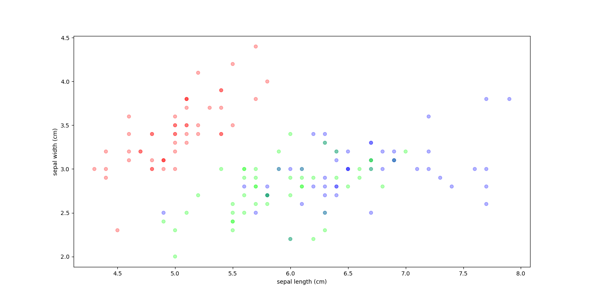

<a id="readme-top"></a>

[![Contributors][contributors-shield]][contributors-url]
[![Forks][forks-shield]][forks-url]
[![Stargazers][stars-shield]][stars-url]
[![Issues][issues-shield]][issues-url]
[![MIT License][license-shield]][license-url]
[![LinkedIn][linkedin-shield]][linkedin-url]

<br />
<div align="center">
  <a href="https://github.com/lennymalard/melpy-project">
    
  </a>

<h3 align="center" style="font-size: 25px;"> Crafting Deep Learning from the Ground Up </h3>
  <p align="center">
    <a>
    <br />
    <a href="https://github.com/lennymalard/melpy-project"><strong>Explore the docs »</strong></a>
    <br />
    <br />
    <a href="https://github.com/lennymalard/melpy-project">View Demo</a>
    ·
    <a href="https://github.com/lennymalard/melpy-project/issues/new?labels=bug&template=bug-report---.md">Report Bug</a>
    ·
    <a href="https://github.com/lennymalard/melpy-project/issues/new?labels=enhancement&template=feature-request---.md">Request Feature</a>
  </p>
</div>


<details>
  <summary>Table of Contents</summary>
  <ol>
    <li>
      <a href="#about-the-project">About The Project</a>
      <ul>
        <li><a href="#built-with">Built With</a></li>
      </ul>
    </li>
    <li>
      <a href="#getting-started">Getting Started</a>
      <ul>
        <li><a href="#prerequisites">Prerequisites</a></li>
        <li><a href="#installation">Installation</a></li>
      </ul>
    </li>
    <li><a href="#core-features">Core Features</a></li>
      <ul>
        <li><a href="#automatic-differentiation-engine">Automatic Differentiation Engine</a></li>
        <li><a href="#popular-deep-learning-architectures">Popular Deep Learning Architectures</a></li>
        <li><a href="#modularity-and-extensibility">Modularity and Extensibility</a></li>
      </ul>
    <li><a href="#model-creation-and-training">Model Creation and Training</a></li>
      <ul>
        <li><a href="#preprocessing">Preprocessing</a></li>
        <li><a href="#model-creation">Model Creation</a></li>
        <li><a href="#model-summary">Model Summary</a></li>
        <li><a href="#training-the-model">Training the Model</a></li>
        <li><a href="#save-your-work">Save your Work</a></li>
      </ul>
    <li><a href="#errors">Errors</a></li>
       <ul>
        <li><a href="#shape-errors">Shape Errors</a></li>
      </ul>
    <li><a href="#roadmap">Roadmap</a></li>
    <li><a href="#contributing">Contributing</a></li>
    <li><a href="#license">License</a></li>
    <li><a href="#contact">Contact</a></li>

  </ol>
</details>


## About The Project

Melpy is a **Python deep learning library** built **from scratch** using only **NumPy**. It provides an accessible way to create, train, and understand fundamental **neural network** architectures like **Feedforward Neural Networks (FNNs), Convolutional Neural Networks (CNNs), and Long Short-Term Memory (LSTMs)**, featuring a clear **automatic differentiation** engine. Ideal for learners and those seeking intuition into **machine learning** algorithms without high-level abstractions.

Started in 2022 during high school, this project stemmed from frustration with the lack of clarity in how complex algorithms worked in existing frameworks. Building custom implementations led to deeper understanding and evolved into Melpy.

Inspired by leading **machine learning** tools, Melpy simplifies creating and training common **deep learning** models. It includes essential tools for data preprocessing and visualization, offering a complete, albeit fundamental, **neural network** workflow. Melpy's key feature is simplicity, offering an accessible experience for beginners exploring **deep learning**. It serves as both a learning resource and a foundation for expansion, implementing core functionalities simply to provide clear intuition.

<p align="right">(<a href="#readme-top">back to top</a>)</p>

### Built With

 [![Numpy][Numpy.org]][numpy-url] [![Matplotlib][Matplotlib.org]][Matplotlib-url] [![tqdm][tqdm.github.io]][tqdm-url] [![H5PY][docs.h5py.org]][h5py-url]
<p align="right">(<a href="#readme-top">back to top</a>)</p>

## Getting Started

### Prerequisites

Requires an up-to-date **Python** environment ([conda](https://www.anaconda.com/download) recommended for scientific use).

Dependencies (including **NumPy**) are installed automatically.

### Installation

Melpy is available on PyPI. Install the latest version using pip:
   ```sh
   pip3 install melpy --upgrade
   ```

<p align="right">(<a href="#readme-top">back to top</a>)</p>

## Core Features

### Automatic Differentiation Engine

Melpy computations rely on `Tensor` objects (extended **NumPy** arrays) and `Operation` types. Together, they construct **computational graphs**, enabling precise **gradient calculation** via an **automatic differentiation** algorithm. This simplifies implementing the **backpropagation** step for various layer types in your **neural network**.

[Tensor](https://github.com/lennymalard/melpy-project/blob/main/melpy/Tensor.py#L4) extends NumPy arrays, adding `requires_grad` (bool), `grad` (gradient array), and `_op` (producing operation) attributes.
```
Class Tensor:
    Function __init__(object, requires_grad, _operation, additional arguments):
        Attributes
        - array : float64 numpy array
        - grad : float64 numpy array
        - requires_grad : bool
        - _op : melpy operation
```

[Operation](https://github.com/lennymalard/melpy-project/blob/main/melpy/Tensor.py#L164) adds a forward pass (builds the graph) and a backward pass (computes derivatives, updates/propagates gradients).
```
Class _Operation:
    Function __init__(x1, x2, additional arguments):
        Attributes
        - x1 : melpy tensor
        - x2 : melpy tensor
        - output : melpy tensor
```

Example: Compute y = 5 * x, find dy/dx using **automatic differentiation**.
```python
x = tensor([1,2,3,4,5], requires_grad=True)
y = 5 * x

print(y)
```
Output:
```sh
Tensor([5., 10., 15., 20., 25.])
```

Propagate gradient backward:
```python
y.backward(1)

print(x.grad)
```
Output shows dy/dx = 5 for each element, as expected:
```sh
array([5., 5., 5., 5., 5.])
```

<br>
<div align="center">
 
 <p >
  <em>Figure 1: Computational graph of the operation (forward/backward passes).</em>
 </p>
</div>

Tensor and Operation classes form Melpy's core, simplifying complex **neural network** architecture implementation.

_Learn more about **automatic differentiation** on [Wikipedia](https://en.wikipedia.org/wiki/Automatic_differentiation)._

<p align="right">(<a href="#readme-top">back to top</a>)</p>

### Popular Deep Learning Architectures

Melpy supports common **deep learning models** built **from scratch**:
* **Feedforward Neural Networks (FNNs)**: Using `Dense` layers for tasks like **classification** or regression on tabular data.
* **Convolutional Neural Networks (CNNs)**: Using `Convolution2D` layers, suitable for basic **image recognition** tasks.
* **Recurrent Neural Networks (RNNs)**: Specifically **Long Short-Term Memory (LSTM)** units for **sequence analysis** or time series prediction.

Build these architectures using provided layers and train using the `Sequential` class.

Future plans include Batch Normalization and potentially generative models like GANs.

<p align="right">(<a href="#readme-top">back to top</a>)</p>

### Modularity and Extensibility

Key strength: Modularity. Melpy leverages Object-Oriented Programming with specific types, making it easy to add/modify layers, loss functions, callbacks, etc.

The `Tensor` type combined with **automatic differentiation** simplifies creating new components without manual **gradient calculation** for simpler tasks. The `Sequential` class integrates components while allowing custom **neural network** architectures and training loops. 

Result: Melpy is flexible, adaptable, and upgradable.

<p align="right">(<a href="#readme-top">back to top</a>)</p>

## Model Creation and Training

Example: Train a **Feedforward Neural Network (FNN)** for Iris flower **classification**, a classic **machine learning** problem. The dataset has 3 classes and 4 features. Build models for tasks ranging from simple **classification** (like this example) to basic **image recognition** (using `Convolution2D`) or **sequence analysis** (with `LSTM`).

Load data and split:
```python
from sklearn.datasets import load_iris
from sklearn.model_selection import train_test_split

iris_dataset = load_iris()

X_train, X_test, y_train, y_test = train_test_split(
        iris_dataset['data'], iris_dataset['target'], test_size=0.25, random_state=0)
```
Visualize data:
```python
import matplotlib.pyplot as plt

plt.figure()
plt.scatter(X_train[:,0], X_train[:,1], c=y_train, alpha=0.3, cmap="coolwarm")
plt.show()
```
<br>
<div align="center">
 
 <p >
  <em>Figure 2: Iris dataset visualized, showing feature separation.</em>
 </p>
</div>

Figure 2 shows correlation between features (Sepal Length/Width) and species.
<br>
<br>

### Preprocessing

**Neural Networks** often require scaled input. Use `StandardScaler`:

*The Standard Scaler centers data (removes mean) and scales by variance. More on [Feature Scaling](https://en.wikipedia.org/wiki/Feature_scaling).*
```python
from melpy.preprocessing import StandardScaler

sc = StandardScaler()
X_train = sc.transform(X_train)
X_test = sc.transform(X_test)
```

Encode target labels using `OneHotEncoder` for **classification**:

*One-hot encoding represents categories as binary vectors. More on [One-hot](https://en.wikipedia.org/wiki/One-hot).*
```python
from melpy.preprocessing import OneHotEncoder

ohe = OneHotEncoder()
y_train = ohe.transform(y_train)
y_test = ohe.transform(y_test)
```

### Model Creation

For this multi-class tabular **classification** problem, we need:
*	[Dense](https://en.wikipedia.org/wiki/Multilayer_perceptron) Layers (Fully Connected) for feature learning.
*	[Softmax](https://en.wikipedia.org/wiki/Softmax_function) [Activation](https://en.wikipedia.org/wiki/Activation_function) for probability outputs.
*	[Categorical Cross-Entropy](https://en.wikipedia.org/wiki/Cross-entropy) loss function for optimization.

Build the **neural network** model with `Sequential`:

*Sequential models stack layers linearly; data flows sequentially.*
```python
import melpy.NeuralNetworks as nn

# Define the sequential model structure
model = nn.Sequential(X_train, y_train, X_test, y_test)

# Add layers: Input -> Hidden (ReLU) -> Output (Softmax)
model.add(nn.Dense(X_train.shape[1], 6, activation="relu"))
model.add(nn.Dense(6, y_train.shape[1], activation="softmax"))

# Compile the model with loss function and optimizer
model.compile(loss_function=nn.CategoricalCrossEntropy(), optimizer=nn.SGD(learning_rate=0.01))
```

We define: Training/validation data, hidden layer (6 neurons, [ReLU](https://en.wikipedia.org/wiki/Rectifier_(neural_networks)) activation), output layer (Softmax activation), loss function, and optimizer (SGD).

*This defines the **FNN architecture**. New to **deep learning**? Check [3Blue1Brown](https://youtu.be/aircAruvnKk?si=QMDAzU8ThgQ_nmTt)'s excellent video series.*

### Model Summary

View model structure:
```python
model.summary()
```
```sh
Dense: (1, 6)
Dense: (1, 3)
```

### Training the Model

Train the **neural network** model:
```python
model.fit(epochs=5000, verbose = 1, callbacks=[nn.LiveMetrics()])
model.results()
```
<div align="center">
 
 <p >
  <em>Figure 3: Plot updated during training via LiveMetrics() callback.</em>
 </p>
</div>

```sh
Epoch [5000/5000]: 100%|██████████| 5000/5000 [00:03<00:00, 1543.94it/s, loss=0.0389, accuracy=0.988]

-------------------------------------------------------------------
| [TRAINING METRICS] train_loss: 0.03893 · train_accuracy: 0.9881 |
-------------------------------------------------------------------
| [VALIDATION METRICS] val_loss: 0.06848 · val_accuracy: 0.98246  |
-------------------------------------------------------------------
```

Achieves ~98% accuracy on train/test. Good result for this simple **neural network**. Potential for 100% with tuning.

Right plot shows model inputs colored by prediction, visually confirming good training performance.

### Save Your Work

Save trained **model parameters** and metrics:
```python
model.save_params("iris_parameters")
model.save_histories("iris_metrics")
```

Reload parameters with `load_params(path)` and metrics using [h5py](https://docs.h5py.org/en/stable/).

_See more examples (including potential **CNN** or **LSTM** use cases) in the [Examples folder](https://github.com/lennymalard/melpy-project/tree/main/examples)_

<p align="right">(<a href="#readme-top">back to top</a>)</p>

## Errors

First, clear your console to avoid issues with old variables.

### Shape Errors
Most runtime errors in **neural network** code involve tensor shape mismatches. Common cause: Mismatched input/output feature counts between consecutive `Dense` or `Convolution2D` layers.

Dense example:
```python
model.add(nn.Dense(X_train.shape[1], 7, activation="relu")) # Output has 7 features
model.add(nn.Dense(6, y_train.shape[1], activation="softmax")) # Expects 6 input features
```
```sh
ValueError: shapes (1,7) and (6,2) not aligned: 7 (dim 1) != 6 (dim 0) 
```
Convolution2D example:
```python
model.add(nn.Convolution2D(in_channels=1, out_channels=32, ...)) # Output has 32 channels
model.add(nn.Convolution2D(in_channels=12, out_channels=64, ...)) # Expects 12 input channels
```
```sh
ValueError: matmul: Input operand 1 has a mismatch in its core dimension 0, with gufunc signature (n?,k),(k,m?)->(n?,m?) (size 128 is different from 48)
```
Resolution: Ensure `out_features`/`out_channels` of a layer match the expected `in_features`/`in_channels` of the *next* layer in the sequence. 

<p align="right">(<a href="#readme-top">back to top</a>)</p>

## Roadmap

Future plans:
* Optimize computation speed (potentially using Numba, JAX and/or multiprocessing).
* Implement more **deep learning** architectures (e.g., GANs).
* Add traditional **machine learning** algorithms.
* Expand layer options.

See [open issues](https://github.com/lennymalard/melpy-project/issues) for proposed features and known issues.

<p align="right">(<a href="#readme-top">back to top</a>)</p>

## Contributing

Contributions make the open source community thrive and are **greatly appreciated**. Help improve this **deep learning library**!

If you have suggestions, please fork the repo and create a pull request, or open an issue with the "enhancement" tag. Don't forget to star the project! Thanks!

1. Fork the Project
2. Create your Feature Branch (`git checkout -b feature/AmazingFeature`)
3. Commit your Changes (`git commit -m 'Add some AmazingFeature'`)
4. Push to the Branch (`git push origin feature/AmazingFeature`)
5. Open a Pull Request

<p align="right">(<a href="#readme-top">back to top</a>)</p>

## License

Distributed under the MIT License. See `LICENSE.txt` for details.

<p align="right">(<a href="#readme-top">back to top</a>)</p>


## Contact

Lenny Malard - lennymalard@gmail.com or [Linkedin](https://www.linkedin.com/in/lennymalard/)

Project Link: [https://github.com/lennymalard/melpy-project](https://github.com/lennymalard/melpy-project)

<p align="right">(<a href="#readme-top">back to top</a>)</p>

[contributors-shield]: https://img.shields.io/github/contributors/lennymalard/melpy-project.svg?style=for-the-badge
[contributors-url]: https://github.com/lennymalard/melpy-project/graphs/contributors
[forks-shield]: https://img.shields.io/github/forks/lennymalard/melpy-project.svg?style=for-the-badge
[forks-url]: https://github.com/lennymalard/melpy-project/network/members
[stars-shield]: https://img.shields.io/github/stars/lennymalard/melpy-project.svg?style=for-the-badge
[stars-url]: https://github.com/lennymalard/melpy-project/stargazers
[issues-shield]: https://img.shields.io/github/issues/lennymalard/melpy-project.svg?style=for-the-badge
[issues-url]: https://github.com/lennymalard/melpy-project/issues/
[license-shield]: https://img.shields.io/github/license/lennymalard/melpy-project.svg?style=for-the-badge
[license-url]: https://github.com/lennymalard/melpy-project/blob/main/LICENSE
[linkedin-shield]: https://img.shields.io/badge/-LinkedIn-black.svg?style=for-the-badge&logo=linkedin&colorB=555
[linkedin-url]: https://www.linkedin.com/in/lennymalard
[product-screenshot]: images/screenshot.png
[Numpy-url]: https://numpy.org/
[Numpy.org]:https://img.shields.io/badge/numpy-red?style=for-the-badge&labelColor=blue&color=blue
[Matplotlib-url]: https://matplotlib.org
[Matplotlib.org]: https://img.shields.io/badge/matplotlib-orange?style=for-the-badge&labelColor=blue&color=blue&link=https%3A%2F%2Fmatplotlib.org%2F
[tqdm-url]: https://tqdm.github.io
[tqdm.github.io]: https://img.shields.io/badge/tqdm-orange?style=for-the-badge&labelColor=blue&color=blue&link=https%3A%2F%2Ftqdm.github.io%2F
[h5py-url]: https://docs.h5py.org/en/stable/
[docs.h5py.org]: https://img.shields.io/badge/H5PY-blue?style=for-the-badge&color=blue

